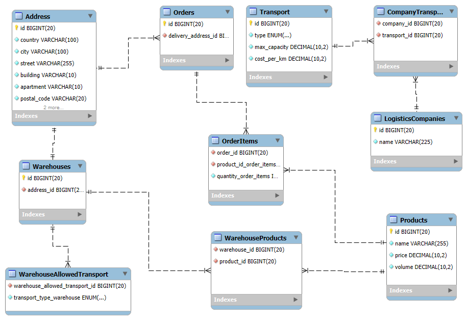

# **Optimising logistics for order fulfilment**
Logistics optimization for order fulfillment system, developed in Java and according to SOLID principles and enterprise-level design patterns.

## **Table of contents**

* Overview
* System architecture
* Database model
* Recommendation algorithms
* Design patterns
* Project Structure
* Getting Started
* Future improvements

## **Overview**

This application offers logistics optimization for order fulfillment system with several sorting algorithms and inline order optimization that takes into account cost, distance, capacity and volume of orders.

## **System architecture**
## **Database model**

## **Recommendation algorithms**
1. For each order:
* Find all warehouses, that have all the products from order
* Calculate distance between them using Pythagorean theorem
* Return the closest warehouse
2. For each company:
* Check matching transport types with warehouse
* Check which of them can fit the entire order (by volume)
* Calculate prices of left transport types
* Sort by price ang get the cheapest one
3. Choose the cheapest company for every order
* Return order and assigned to it transport, price and company

## **Design patterns**

## **Project Structure**

## **Getting Started**
### Prerequisites
* Java 17
* MySQL 8.0+
* Maven

### Installation
* Clone the repository:
  

* Configure database connection in  src/main/resources/config.properties:

  
* Create the database schema:

* Build the project:

* Run the demo:

## **Future improvements**

